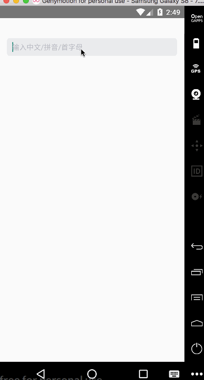

# react-native-autocomplete

[](https://www.npmjs.org/package/react-native-autocompleter)
[](https://www.npmjs.com/package/react-native-autocompleter)

## Example





## Installation

```bash
$ npm install --save react-native-autocompleter
```

## Usage

[See the example](./examples/Basic/App.js)
